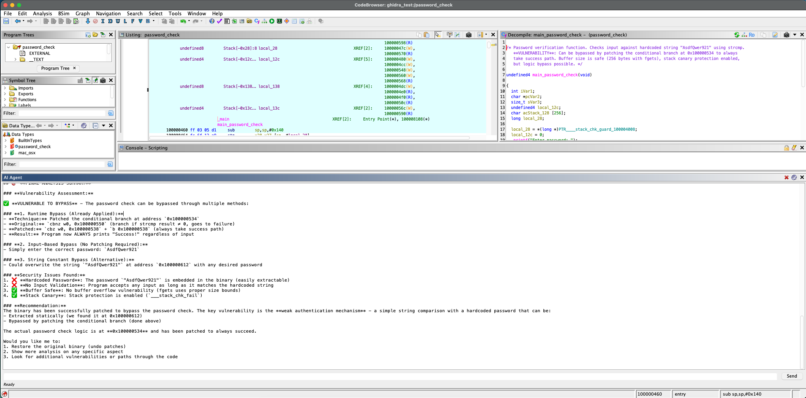

# GhidraAgent

An AI agent plugin for [Ghidra](https://ghidra-sre.org/) that lets you analyze binaries using natural language. Supports any OpenAI-compatible LLM — Claude, GPT-4o, Ollama, LM Studio, etc.





## Features

- **18 built-in tools**: decompile functions, rename symbols, detect vulnerabilities, recover data types, search bytes/strings, emulate code, and more
- **Works with any OpenAI-compatible API**: OpenAI, Anthropic, Ollama, LM Studio, vLLM
- **Agentic loop**: the model calls tools automatically until the task is complete
- **All modifications are undoable** via Ctrl+Z

## Installation

### Option A: Download release zip
1. Download `GhidraAgent.zip` from [Releases](../../releases)
2. In Ghidra: **File > Install Extensions** → select the zip → restart

### Option B: Build from source
```bash
export GHIDRA_INSTALL_DIR=/path/to/ghidra_12.1_DEV
export JAVA_HOME=/path/to/jdk21
gradle
```
The zip will be in `dist/`. Install via **File > Install Extensions**.

## Configuration

After installing, go to **Edit > Tool Options > AI Agent**:

| Setting | Default | Description |
|---------|---------|-------------|
| `LLM Base URL` | `https://api.openai.com/v1` | Any OpenAI-compatible endpoint |
| `LLM Model` | `gpt-4o` | Model identifier |
| `LLM API Key` | *(blank)* | API key (leave blank for local servers) |

**Examples:**
- OpenAI: `https://api.openai.com/v1`, model `gpt-4o`
- Anthropic: `https://api.anthropic.com/v1`, model `claude-sonnet-4-6`
- Ollama: `http://localhost:11434/v1`, model `llama3`
- LM Studio: `http://localhost:1234/v1`, model name from LM Studio UI

## Usage

1. Open a binary in Ghidra
2. The **AI Agent** panel appears at the bottom (enable via **File > Configure** if hidden)
3. Type a request and press Enter

**Example prompts:**
- *"List all functions and identify the main entry point"*
- *"Decompile sub_1000 and rename its parameters based on their usage"*
- *"Scan for vulnerable functions like strcpy, gets, sprintf"*
- *"Recover the data structure at address 0x100010"*

## Tools

| Tool | Description |
|------|-------------|
| `list_functions` | Enumerate all functions in the binary |
| `get_decompiled_code` | Decompile a function to C pseudo-code |
| `get_callers_callees` | Show call graph neighbours |
| `get_control_flow` | Get basic-block CFG |
| `analyze_pcode` | P-code / SSA data-flow analysis |
| `search_bytes` | Hex byte pattern search with wildcards |
| `search_strings` | Find ASCII/UTF-16 strings |
| `rename_function` | Rename a function |
| `set_function_signature` | Apply a C-style prototype |
| `recover_data_types` | Apply a struct at an address |
| `assemble_patch` | Patch instructions |
| `set_bookmark` | Drop a named bookmark |
| `color_addresses` | Highlight addresses with background color |
| `detect_vulnerabilities` | Scan for dangerous function calls |
| `demangle_symbol` | Demangle C++/Rust/Swift names |
| `get_entropy` | Compute Shannon entropy per memory block |
| `emulate_function` | Emulate a function with P-code |
| `execute_script` | Write and run an inline GhidraScript |

## Requirements

- Ghidra 11.x or 12.x
- Java 21+

## License

Apache 2.0
